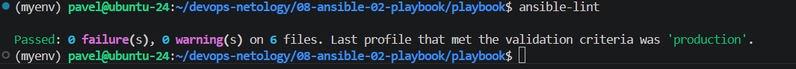
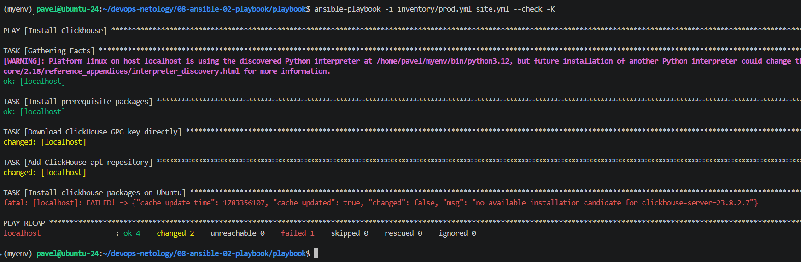
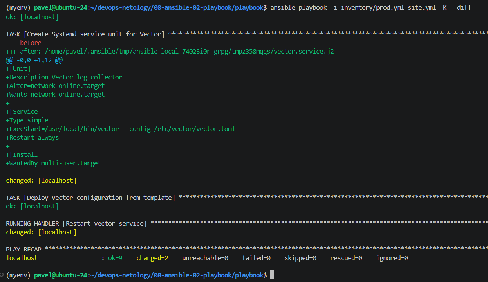
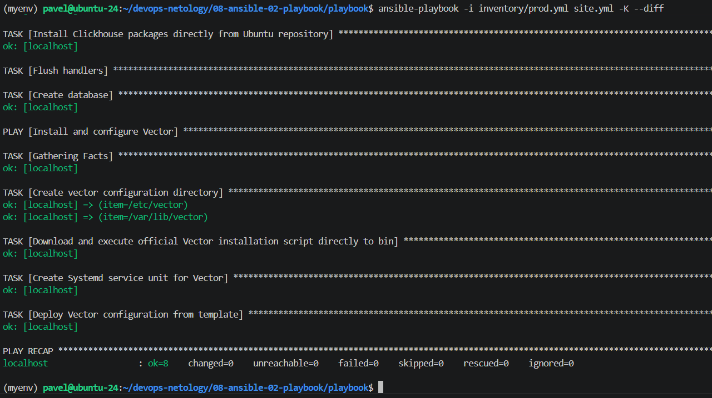

# Домашнее задание к занятию 2 «`Работа с Playbook`»  - `Рыбянцев Павел`

## Подготовка к выполнению

1. * Необязательно. Изучите, что такое [ClickHouse](https://www.youtube.com/watch?v=fjTNS2zkeBs) и [Vector](https://www.youtube.com/watch?v=CgEhyffisLY).
2. Создайте свой публичный репозиторий на GitHub с произвольным именем или используйте старый.
3. Скачайте [Playbook](./playbook/) из репозитория с домашним заданием и перенесите его в свой репозиторий.
4. Подготовьте хосты в соответствии с группами из предподготовленного playbook.

## Основная часть

1. Подготовьте свой inventory-файл `prod.yml`.
2. Допишите playbook: нужно сделать ещё один play, который устанавливает и настраивает [vector](https://vector.dev). Конфигурация vector должна деплоиться через template файл jinja2. От вас не требуется использовать все возможности шаблонизатора, просто вставьте стандартный конфиг в template файл. Информация по шаблонам по [ссылке](https://www.dmosk.ru/instruktions.php?object=ansible-nginx-install). не забудьте сделать handler на перезапуск vector в случае изменения конфигурации!
3. При создании tasks рекомендую использовать модули: `get_url`, `template`, `unarchive`, `file`.
4. Tasks должны: скачать дистрибутив нужной версии, выполнить распаковку в выбранную директорию, установить vector.
5. Запустите `ansible-lint site.yml` и исправьте ошибки, если они есть.


6. Попробуйте запустить playbook на этом окружении с флагом `--check`.


7. Запустите playbook на `prod.yml` окружении с флагом `--diff`. Убедитесь, что изменения на системе произведены.


8. Повторно запустите playbook с флагом `--diff` и убедитесь, что playbook идемпотентен.


9. Подготовьте README.md-файл по своему playbook. В нём должно быть описано: что делает playbook, какие у него есть параметры и теги. Пример качественной документации ansible playbook по [ссылке](https://github.com/opensearch-project/ansible-playbook). Так же приложите скриншоты выполнения заданий №5-8

### Что делает этот Playbook?
Данный плейбук предназначен для автоматизированного развёртывания и конфигурирования аналитической СУБД ClickHouse и агента сбора логов Vector на целевых хостах под управлением операционной системы семейства Ubuntu/Debian.
Плейбук разбит на два логических сценария (Plays):
    Install Clickhouse:
        Обновляет кэш пакетов целевой системы,
        устанавливает СУБД clickhouse-server и клиент clickhouse-client напрямую из репозиториев дистрибутива,
        запускает службу и инициализирует базу данных logs для последующего хранения логов.

    Install and configure Vector:
        Создаёт необходимые системные директории,
        скачивает и инициализирует бинарный файл Vector через официальный инсталляционный скрипт,
        разворачивает systemd-сервис и деплоит файл конфигурации vector.toml на основе динамического шаблона Jinja2.
        При изменении конфигурации автоматически срабатывает обработчик (Handler) для перезапуска демона.

### Параметры и переменные (Variables)
Конфигурация плейбука является гибкой и кастомизируется через переменные групп хостов в каталоге `group_vars/`:
    Группа `clickhouse` (`group_vars/clickhouse/vars.yml`):
        `clickhouse_version`: 
            Версия пакетов ClickHouse, фиксируемая для установки (например, "23.8.2.7").
    Группа `vector` (`group_vars/vector/vars.yml`):
        `vector_data_dir`:
            Абсолютный путь к директории, в которой Vector будет хранить свои внутренние данные и кэш (по умолчанию: `/var/lib/vector`).

### Шаблонизация (Templates)
    В проекте используются два шаблона Jinja2 (`.j2`), находящиеся в папке `templates/`:
        `vector.toml.j2` — конфигурационный файл агента Vector. 
        Динамически подставляет путь к данным из переменной `{{ vector_data_dir }}`.
        `vector.service.j2` — юнит-файл для менеджера системных служб systemd, обеспечивающий работу Vector в фоне как полноценного демона.
        
### Обработчики событий (Handlers)
Для оптимизации работы и исключения лишних перезапусков сервисов в продакшене используются следующие хэндлеры:
    `Start clickhouse service` — выполняет первоначальный старт или перезапуск `clickhouse-server` при установке пакетов.
    `Restart vector service` — выполняет перезагрузку конфигурации менеджера systemd (`daemon_reload: true`) и перезапускает службу `vector` только в случае реального изменения шаблона конфигурации или самого юнит-файла.
    
### Теги и запуск плейбука (Execution)
Поскольку задачи в плейбуке жестко разделены по целевым хостам/группам (`hosts: clickhouse и hosts: vector`),
можно изолированно запускать нужные этапы с помощью указания ограничений или флага `--limit`.

### Команды для проверки и запуска:
```
# 1. Проверка синтаксиса и качества кода (ansible-lint)
ansible-lint site.yml

# 2. Тестовый холостой прогон (Dry-run проверка)
ansible-playbook -i inventory/prod.yml site.yml --check -K

# 3. Реальный запуск с выводом изменений в файлах
ansible-playbook -i inventory/prod.yml site.yml -K --diff
```

10. Готовый playbook выложите в свой репозиторий, поставьте тег `08-ansible-02-playbook` на фиксирующий коммит, в ответ предоставьте ссылку на него.

---

### Как оформить решение задания

Приложите ссылку на ваше решение в поле "Ссылка на решение" и нажмите "Отправить решение"

---