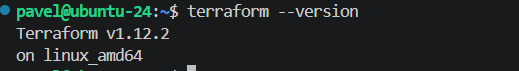
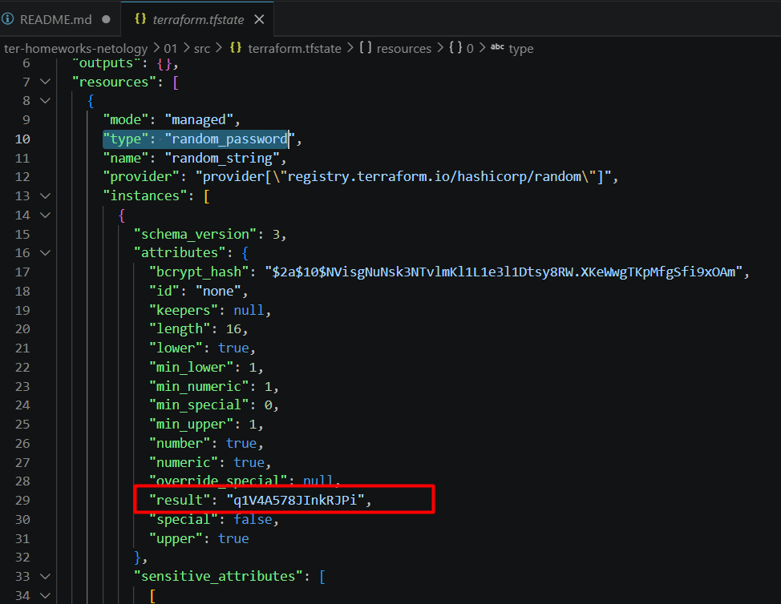
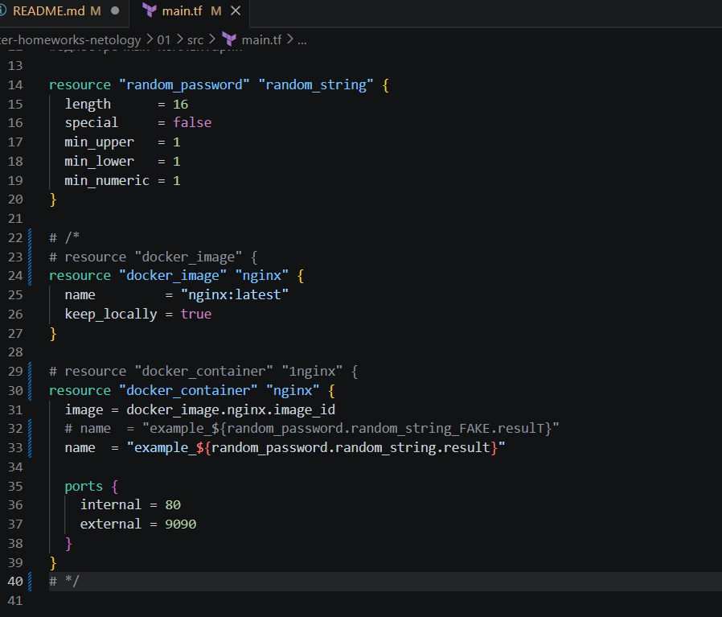
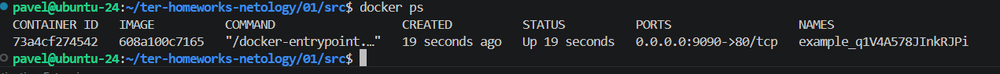
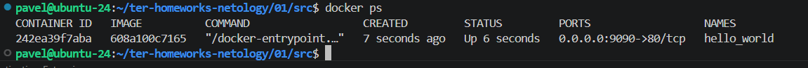
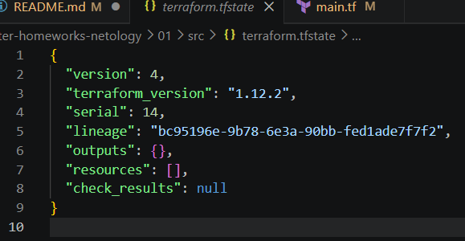

# Домашнее задание к занятию «`Введение в Terraform`» - `Рыбянцев Павел`

### Цели задания

1. Установить и настроить Terrafrom.
2. Научиться использовать готовый код.

------

### Чек-лист готовности к домашнему заданию

1. Скачайте и установите **Terraform** версии >=1.12.0 . Приложите скриншот вывода команды ```terraform --version```.

2. Скачайте на свой ПК этот git-репозиторий. Исходный код для выполнения задания расположен в директории **01/src**.
3. Убедитесь, что в вашей ОС установлен docker.

------

### Инструменты и дополнительные материалы, которые пригодятся для выполнения задания

1. Репозиторий с ссылкой на зеркало для установки и настройки Terraform: [ссылка](https://github.com/netology-code/devops-materials).
2. Установка docker: [ссылка](https://docs.docker.com/engine/install/ubuntu/). 
------
### Внимание!! Обязательно предоставляем на проверку получившийся код в виде ссылки на ваш github-репозиторий!
------

### Задание 1

1. Перейдите в каталог [**src**](https://github.com/netology-code/ter-homeworks/tree/main/01/src). Скачайте все необходимые зависимости, использованные в проекте. 
2. Изучите файл **.gitignore**. В каком terraform-файле, согласно этому .gitignore, допустимо сохранить личную, секретную информацию?(логины,пароли,ключи,токены итд)
Ответ: `personal.auto.tfvars`

3. Выполните код проекта. Найдите  в state-файле секретное содержимое созданного ресурса **random_password**, пришлите в качестве ответа конкретный ключ и его значение.


4. Раскомментируйте блок кода, примерно расположенный на строчках 29–42 файла **main.tf**.
Выполните команду ```terraform validate```. Объясните, в чём заключаются намеренно допущенные ошибки. Исправьте их.
```
1. resource "docker_image" { -- отсутсвует локальное имя ресурса (обязательный атрибут)
2. resource "docker_container" "1nginx" { -- идентификаторы ресурсов в Terraform не могут начинаться с цифры
3. image = docker_image.nginx.image_id -- ссылка на несуществующее имя
4. random_password.random_string_FAKE.resulT - неверная ссылка на ресурс(*_FAKE) и регистрозависимость(в атрибуте resulT)
```

5. Выполните код. В качестве ответа приложите: исправленный фрагмент кода и вывод команды ```docker ps```.




6. Замените имя docker-контейнера в блоке кода на ```hello_world```. Не перепутайте имя контейнера и имя образа. Мы всё ещё продолжаем использовать name = "nginx:latest". Выполните команду ```terraform apply -auto-approve```.
Объясните своими словами, в чём может быть опасность применения ключа  ```-auto-approve```. Догадайтесь или нагуглите зачем может пригодиться данный ключ? В качестве ответа дополнительно приложите вывод команды ```docker ps```.

```
1. В чём опасность применения ключа -auto-approve?
    Данный флаг полностью отключает шаг подтверждения со стороны пользователя (Do you want to perform these actions?).
    Если была допущена ошибка (например переименование ресурсов или удаление), terraform выполнит это действие мгновенно (без аппрува).
    Возможность просмотреть план (plan) и отменить операцию отсутствует.

2. Зачем может пригодиться данный ключ?
    Этот ключ используется в автоматизации (CI/CD пайплайнах (например, GitLab CI, GitHub Actions, Jenkins)) 
```

8. Уничтожьте созданные ресурсы с помощью **terraform**. Убедитесь, что все ресурсы удалены. Приложите содержимое файла **terraform.tfstate**.
 

9. Объясните, почему при этом не был удалён docker-образ **nginx:latest**. Ответ **ОБЯЗАТЕЛЬНО НАЙДИТЕ В ПРЕДОСТАВЛЕННОМ КОДЕ**, а затем **ОБЯЗАТЕЛЬНО ПОДКРЕПИТЕ** строчкой из документации [**terraform провайдера docker**](https://library.tf/providers/kreuzwerker/docker/latest).  (ищите в классификаторе resource docker_image )
```
resource "docker_image" "nginx" {
.....
  keep_locally = true
.....
}

keep_locally (Boolean) If true, then the Docker image won't be deleted on destroy operation. 
If this is false, it will delete the image from the docker local storage on destroy operation.

Terraform при выполнении команды destroy удаляет только саму запись о ресурсе, но оставляет скачанный образ локально в Docker-хранилище.
Сделано для экономии трафика и времени при повторных развертываниях.
```

------

### Правила приёма работы

Домашняя работа оформляется в отдельном GitHub-репозитории в файле README.md.   
Выполненное домашнее задание пришлите ссылкой на .md-файл в вашем репозитории.

### Критерии оценки

Зачёт ставится, если:

* выполнены все задания,
* ответы даны в развёрнутой форме,
* приложены соответствующие скриншоты и файлы проекта,
* в выполненных заданиях нет противоречий и нарушения логики.

На доработку работу отправят, если:

* задание выполнено частично или не выполнено вообще,
* в логике выполнения заданий есть противоречия и существенные недостатки. 
